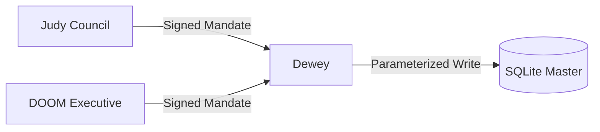

# Dewey Execution Service

Dewey is the secure write-gateway for the Trophy Backlog Command Center. It runs in execution-zone and is the only service that mutates persistence state for approved mandates.

## Architecture Role

- Zone: execution-zone
- Responsibility: execute approved mandates through parameterized SQL only
- Inbound callers: governance-zone (Judy) and executive-zone (DOOM)
- No direct dependency on agent-zone services



## Security Guarantees

- Signature verification on every request (`INBOUND_SIGNATURE_HEADER`)
- Replay protection via nonce registry (`replay_nonces`)
- Time-window enforcement (`issued_at`, `expires_at`, clock-skew checks)
- Verdict gate: only `APPROVED` mandates can execute
- Allowlist enforcement for target table and action types
- Parameterized SQL only (no dynamic SQL)

## gRPC API

Service: `dewey.ExecutionService`

- `Health(google.protobuf.Empty) -> google.protobuf.Struct`
- `GetMetrics(google.protobuf.Empty) -> google.protobuf.Struct`
- `ExecuteMandate(google.protobuf.Struct) -> google.protobuf.Struct`

Contract file: `proto/dewey.proto`

## Mandate Shape (Struct JSON)

```json
{
	"mandate_metadata": {
		"issuer_id": "judy-council",
		"key_id": "judy-k1",
		"issued_at": "2026-07-07T17:45:00+00:00",
		"expires_at": "2026-07-07T17:50:00+00:00",
		"nonce": "nonce-abc12345",
		"correlation_id": "corr-001"
	},
	"council_verdict": "APPROVED",
	"mandated_action": {
		"target_table": "local_backlog",
		"action_type": "UPDATE_STATUS",
		"entity_id": "game_105",
		"payload": {
			"status": "ACTIVE",
			"completion": 90,
			"notes": "Executed by Dewey"
		}
	},
	"rationale": "Council-approved write"
}
```

## Local Run

```bash
docker compose up --build -d
```

Dewey listens on `localhost:50053`.

## Tests

```bash
docker compose run --rm --build dewey pytest -q
```

## Configuration

| Variable | Description | Default |
| --- | --- | --- |
| `ENVIRONMENT` | Runtime environment hint used for startup validation (`dev`, `staging`, `prod`) | `dev` |
| `SERVICE_NAME` | Service name | `dewey-execution` |
| `SERVICE_VERSION` | Version string | `0.1.0` |
| `GRPC_PORT` | gRPC listen port | `50053` |
| `GRPC_MAX_WORKERS` | gRPC thread pool worker count | `32` |
| `GRPC_TLS_ENABLED` | Enable inbound TLS listener | `false` |
| `GRPC_TLS_SERVER_CERT_PATH` | Server cert path for inbound TLS | empty |
| `GRPC_TLS_SERVER_KEY_PATH` | Server key path for inbound TLS | empty |
| `GRPC_TLS_REQUIRE_CLIENT_AUTH` | Require client cert on inbound listener (mTLS) | `false` |
| `GRPC_TLS_CLIENT_CA_CERT_PATH` | Trusted client CA path for inbound mTLS | empty |
| `DEWEY_DB_PATH` | SQLite path | `/data/dewey.db` |
| `DEWEY_ALLOWED_TABLE` | Table allowlist target | `local_backlog` |
| `INBOUND_SIGNATURE_HEADER` | Signature metadata header | `X-Judy-Signature` |
| `INBOUND_SIGNATURE_SECRET` | Shared signature secret | required |
| `MAX_CLOCK_SKEW_SECONDS` | Allowed issue-time skew | `120` |
| `REPLAY_TTL_SECONDS` | Replay protection nonce retention window in seconds | `300` |

### Compose mTLS Profile

Generate local dev certificates first:

```powershell
./scripts/generate-dev-certs.ps1 -Force
```

Run Dewey with inbound TLS + client auth:

```bash
docker compose -f docker-compose.yml -f docker-compose.mtls.yml up --build
```

Verify certificate chains and mTLS handshakes:

```powershell
./scripts/verify-mtls.ps1
```

If Dewey is not running, verify cert trust only:

```powershell
./scripts/verify-mtls.ps1 -SkipHandshake
```

## Kubernetes / Helm

Chart path: `charts/dewey`

```bash
helm upgrade --install dewey charts/dewey -n execution-zone --create-namespace
```

Chart includes:

- Deployment
- ServiceAccount
- Service (gRPC)
- Secret for signature verification
- Ingress-only NetworkPolicy for governance/executive callers
- Optional PVC

## k3d Quick Deploy

```powershell
./scripts/deploy-k3d.ps1
```
